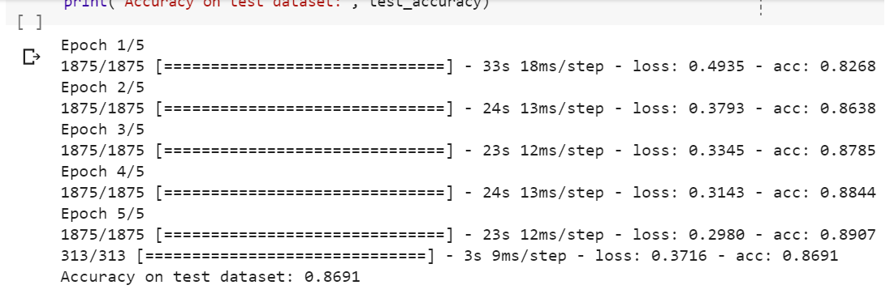

# FashionMnist
This Repository will be focused on the FashionMnist data-set, a collection of clothing images! 
I used Google Colab do do this projects so if any of the imports look unfamiliar to you then they
are probably just neccesary imports needed to work with google colab. Even Though In cases such as this
we don't neccesarily need those imports i always find it easier to include those imports each time i work with colab, you 
dont have to.
# Data
The data we are working with is the fashionMnist dataset. The Dataset contains 10 classes from Shirt to Shoes. In order to use the
dataset though we will resphape the images with numpy and remove the color channel. This also helps us with resource management as 
including a color channel can make the process take alot longer
# Accuracy and lost
As you can see from our notebook our accuracy when On the Test Data set was 86% almost 87% If you want to round up. Now 86% percent is 
pretty good actually but we can do a whole lot better. We would definitely increase the accuracy on the testdata set by increasing the
number of epochs, try it yourself! 

# Conclusion
The fashionMnist data set is cool and all but on the next project I'll be working with real life data because real life data is usually 
really messy while the fashionmnist dataset is already cleaned up for you nice and ready to go. Thank you for checking out This Repository
